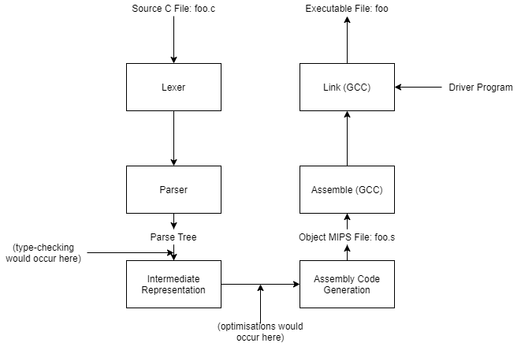

# C to MIPS Compiler

A project from the 2nd Year Module: Instruction Architectures and Compilers in Electronic and Information Engineering at Imperial College London in the Spring Term.  
Contributors: Ani Hazarika & Aryan Ghobadi.

The specification for this project is available [here](specification.md).

Note:
- The compiler was tested completely on functionality as to whether the genearated assembly produced the correct output when linked to the driver file and simulated on qemu-mips. So the compiler does not contain any optimisations.  
- The compiler was only tested on correctly written C code and so there is no expectation that this compiler would handle incorrect code gracefully. Type-checking is not implemented as well.

